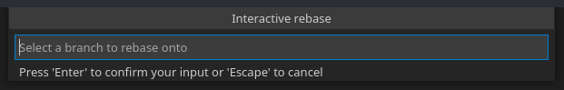

# Extra Git Commands

The Extra Git Commands extension includes two additional vscode commands. One for starting an interactive rebase, and one for hard resetting the state of the repository to the current state of origin.

## Features

To start an interactive rebase launch the command "Extra Git Commands: Start an interactive rebase" (`git-extra-commands.interactive-rebase`). You will then be asked for the branch, you want to rebase the current branch onto.

To reset the current branch to the current state of origin launch the command "Extra Git Commands: Hard reset to the current state of origin"(`git-extra-commands.hard-reset`).

You can also set shortcuts for those commands ;)

The output of the git commands, as well as any debug logs will be printed to the "Extra-Git-Commands" output channel.

## Requirements

This extension requires git to be installed. \([git-scm.com](https://git-scm.com)\)

We also recommend using the GitLens vs-code extension to launch the interactive rebase, as we are currently not using a terminal to start the interactive rebase.

## Known Issues

Currently, the only supported rebase editor is vs-code and its extension GitLens, as we are currently not using a terminal to start the interactive rebase.

We are currently working on switching to the vscode git api instead of talking to git directly.

We are also currently working on integrating tests into the extension. Currently, the tests are the default ones created bei Yeoman.

If you have any issues, please consider submitting them on [github](https://github.com/Greenscreen23/git-extra-commands)

## Release Notes

### 1.0.0

Initial release of Extra Git Commands.

Added the commands for interactive rebase and hard reset.
